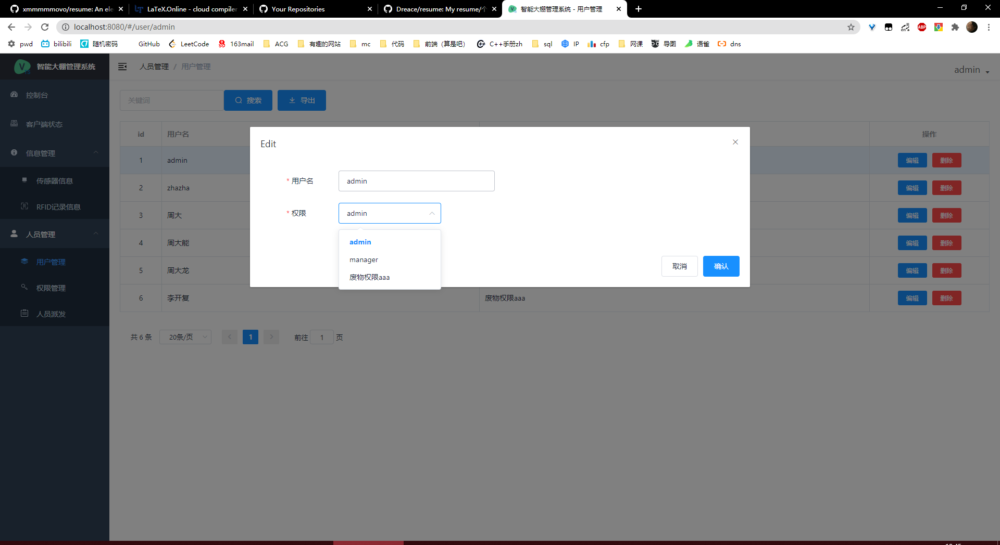

# SmartGreenhouse
智能大棚(物联网大课设)

## 技术选型

| 功能端 |              技术描述               |
| :----: | :---------------------------------: |
|  安卓  |            flutter, dart            |
|  前端  |  vue, typescript, element-ui, vuex  |
|  后端  | python, flask, mysql, redis, docker |
|  硬件  |     raspberry pi, python, emqx      |

## 已知问题

| 功能端 |                           问题描述                           |
| :----: | :----------------------------------------------------------: |
|  安卓  |               1. 过于简单，没有时间查询等功能                |
|  前端  |                1. 查询方面寻找更好的显示方案                 |
|  后端  | 1. 由于部分字段不能用字符串查询所以用了拼接字符串，存在注入风险 2. jwt部分没有做黑名单处理，存在信息盗用风险 3.大部分查询还未进行缓存处理，待理清业务后进行4.因为个人项目就没有写service层 |
|  硬件  | 1. 缺少开关等互动装置 2. 缺少灯管等反馈装置3.RFID有时候会莫名其妙无法识别 |

## 截图

### 硬件端

|                        硬件图片                         |                 启动截图                  |
| :-----------------------------------------------------: | :---------------------------------------: |
|  |  |

### 安卓端

|       登录       |       注册       |
| :--------------: | :--------------: |
|  |  |

|      主界面      |     个人界面     |
| :--------------: | :--------------: |
|  |  |

|     更改设备     |        通知        |
| :--------------: | :----------------: |
|  |  |

|     图表     |
| :--------------: |
|  |

### WEB端

|     Admin权限      |      其他权限      |
| :----------------: | :----------------: |
|  |  |

|     客户端状态     |  支持增删改查导出  |
| :----------------: | :----------------: |
|  |  |

|     传感器信息     |    支持查询导出    |
| :----------------: | :----------------: |
|  |  |

|      RFID信息      |   支持查询导出   |
| :----------------: | :--------------: |
|  |  |

|     人员管理     |    支持删改查     |
| :--------------: | :---------------: |
|  |  |

|     权限管理      |    支持增删改查     |
| :---------------: | :-----------------: |
|  |  |

|     人员派发      | 支持派发查找删除  |
| :---------------: | :---------------: |
|  |  |

